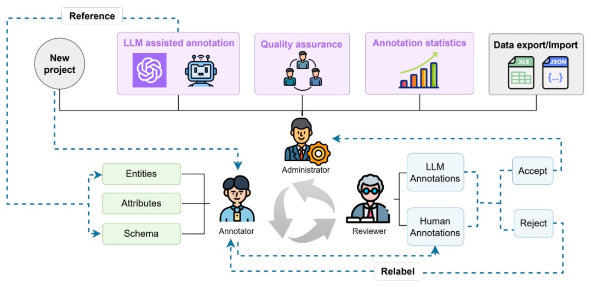
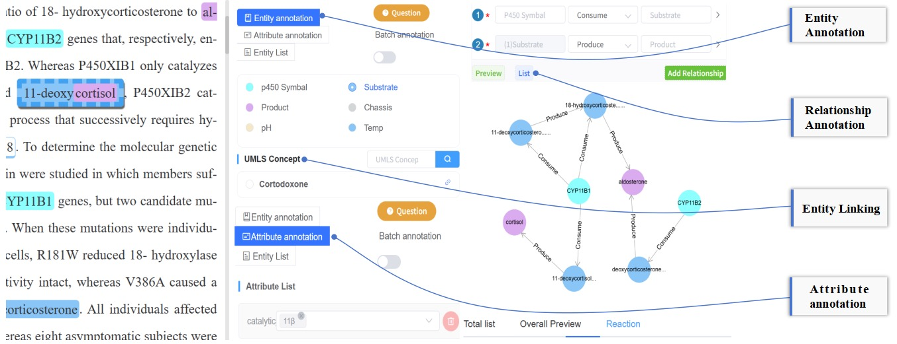

# BNLP: A Systematic LLM-Assisted Collaborative Annotation Platform

[中文文档](README_zh.md) | [Deployment Guidance](DEPLOYMENT.md)

**BNLP** is a natural language annotation platform designed to systematically embed Large Language Models (LLMs) into a controllable, evaluable, and reproducible human-in-the-loop workflow. By treating LLM outputs as intermediate states for human refinement, BNLP bridges the gap between raw AI generation and high-quality "Gold Standard" data.





## 🚀 Key Features

* **Quality-Aware LLM Workflow**: Integrates LLM pre-annotation with multi-role human verification.
* **"Label–Train–Evaluate" Loop**: Supports evolving from general LLMs to domain-specific small models (e.g., BioBERT) as gold data accumulates.
* **Complex Semantic Support**: Native support for discontinuous entities, overlapping/nested NER, directed relation triplets, and attribute binding.
* **Integrated Quality Control**: Real-time calculation of **Fleiss’ Kappa** and **Krippendorff’s Alpha** for inter-annotator agreement (IAA).
* **Seamless Data Pipeline**: Direct compatibility with Excel (for human management) and JSON (for model training).

---

## 🛠 System Architecture

BNLP follows a modern, decoupled architecture for scalability and ease of deployment:

* **Frontend**: Vue.js + Element UI (Responsive, role-based views).
* **Backend**: Spring Boot (RESTful API, Spring Security).
* **Storage**:
* **MongoDB**: Flexible storage for complex JSON document annotations.
* **MySQL**: Structured management of users, permissions, and project metadata.
* **Redis**: Caching and session management.


* **Deployment**: Fully containerized via **Docker Compose**.

---

## 📊 Performance at a Glance

In a case study focused on "Food and Medicine Homology" knowledge extraction:

| Metric | Manual Annotation | LLM Only | **BNLP (LLM + Human)** |
| --- | --- | --- | --- |
| **F1 Score** | 80.16% | 70.42% | **97.92%** |
| **Speedup** | Baseline | 98.1% ↑ | **64% ↑** |
| **Quality** | Baseline | -9.74% ↓ | **22.15% ↑** |

> **Note**: Compared to tools like Brat, YEDDA, and INCEpTION, BNLP reduces average annotation time by **22.5% to 38.9%**.

---

## 📖 Functional Comparison

| Feature | Brat | Doccano | TeamTat | **BNLP** |
| --- | --- | --- | --- | --- |
| **LLM Pre-annotation** | ❌ | ⚠️ (Ext) | ❌ | ✅ |
| **Discontinuous Entities** | ✅ | ❌ | ✅ | ✅ |
| **Excel Upload/Export** | ❌ | ❌ | ❌ | ✅ |
| **IAA Statistics (Kappa)** | ❌ | ❌ | ✅ | ✅ |
| **Model Evolution Loop** | ❌ | ❌ | ❌ | ✅ |

---

## 💻 Getting Started

### Prerequisites

* Docker & Docker Compose
* OpenAI API Key (or local LLM endpoint)

### Installation

1. Clone the repository:
```bash
git clone https://github.com/YourRepo/BNLP.git
cd BNLP

```


2. Configure your environment variables in `.env`.
3. Launch with Docker:
```bash
docker-compose up -d

```


4. Access the UI at `http://localhost:8080`.

---

## 📜 Citation

If you use BNLP in your research, please cite our work:

```bibtex
@article{BNLP2026,
  title={BNLP: A Systematic LLM-Assisted Platform for High-Quality Natural Language Annotation},
  author={Zhuang, Xinhao and Tian, Qiongyu and et al.},
  year={2026}
}

```
